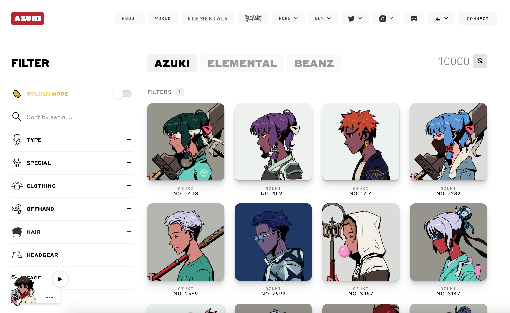
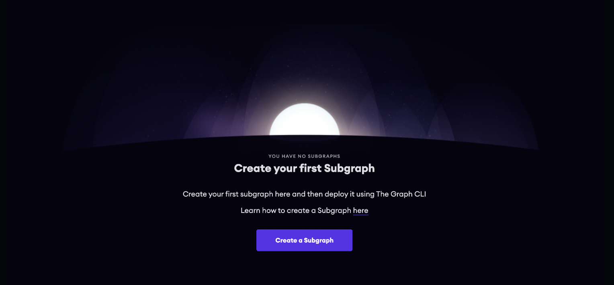
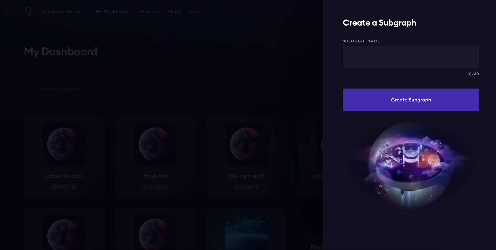
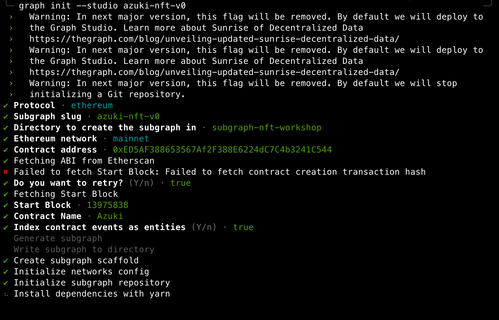
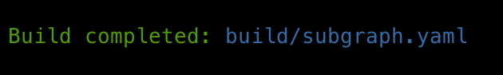
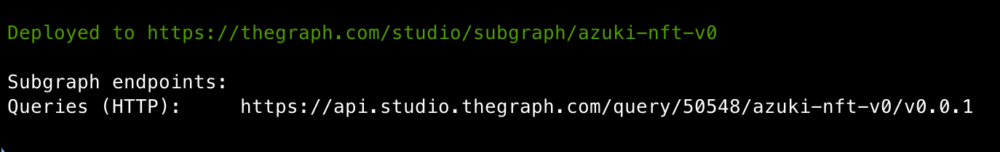
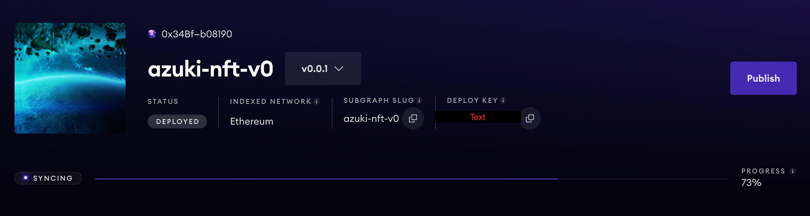

# SUBGRAPH NFT WORKSHOP

## Description

In this workshop, we would be building and deploying a subgraph for the **[Azuki NFT Project](https://opensea.io/collection/azuki)**.

<div id="header" align="center">
    <a href="https://thegraph.com/studio/?show=Create" target="_blank">
    </a>
</div>

### Table of Contents

- [Description](#description)
- [About Azuki & NFTs 🎭](#about-azuki--nfts-🎭)
- [Software Requirements](#software-requirements)
- [Prerequisites](#prerequisites)
- [Setting Up a Subgraph](#setting-up-a-subgraph)
- [Initializing a Subgraph](#initializing-a-subgraph)
- [Building & Deploying Subgraph](#building--deploying-subgraph)
- [Important files generated during subgraph init and build](#important-files-generated-during-subgraph-init-and-build)
  - [🏳️ subgraph.yaml](#🏳️-subgraphyaml)
  - [🏳️ schema.graphql](#🏳️-schemagraphql)

## About Azuki & NFTs 🎭

<div id="header" align="left">
    
</div>

<br/>

Formed by [Chiru Labs](https://www.chirulabs.com/), Azuki is an anime brand crafting stories and experiences that blur the lines between the physical and digital worlds. [Here are some things](https://www.azuki.com/about) they’ve created so far.

<details>

<summary>Boring stuff about NFTs that you already know 🤔</summary>

<br/>

**What's an NFT?**

Imagine a digital certificate of ownership for anything unique online, like art, music, or even tweets. That's essentially what an NFT (Non-Fungible Token) is.

**Characteristics of NFTs**

- Unique: Unlike regular cryptocurrencies (fungible tokens), each NFT is one-of-a-kind and cannot be replaced by another. Think of it like a rare trading card instead of interchangeable cash.

- Stored on a blockchain.

- Smart contracts powered.

- Token standards define properties: Standards like ERC-721 ensure compatibility and interoperability between different platforms and marketplaces.

</details>

## Software Requirements

- [x] [Node.js](https://nodejs.org/en/download/)

- [x] The Graph CLI installed

- For `npm`, install the CLI using this command:

```shell
npm install -g @graphprotocol/graph-cli
```

- For `yarn`, install the CLI using this command:

```shell
yarn global add @graphprotocol/graph-cli
```

- [x] A decent IDE. [VS Code](https://code.visualstudio.com/) is a great option!

## Prerequisites

To follow along on this workshop you need the following:

- Some knowledge of [GraphQL](https://www.howtographql.com/)

- A good understanding of how events work in solidity. This [YouTube Video By Patrick Collins](https://www.youtube.com/watch?v=KDYJC85eS5M) nails it!

- Some experience with TS/JS (optional)

#### Azuki Contract Address

- [x] `0xED5AF388653567Af2F388E6224dC7C4b3241C544`

## Setting Up a Subgraph

- Navigate to [the Graph Studio](https://thegraph.com/studio).

- Click on **Connect Wallet** and authenticate a wallet address

- Once authenticated, click on **Create a Subgraph**.

<div align="left">
    
</div>

- Give the subgraph a name and click **Continue**. In our case, we named ours `azuki-nft-v0`

<div align="left">
    
</div>

## Initializing a Subgraph

So we have successfully setup our Subgraph in the Graph studio. Now, would initialize the subgraph using this command in your terminal:

`graph init --studio azuki-nft-v0`

Replace `azuki-nft-v0` with the name of your subgraph.

Now, we would go through an interactive prompt in our CLI as below:

- Choose a Protocol: click on **Ethereum**

- Fill subgraph-slug: enter the name of your subgraph -- `azuki-nft-v0`

- Directory to create the subgraph in: you can enter the subgraph slug or a different non-existent directory -- `azuki-nft-v0`

- Choose an Ethereum network: click on **mainnet**

- Contract address: We would be using the deployed Azuki contract on Ethereum mainnet -- `0xED5AF388653567Af2F388E6224dC7C4b3241C544`

- In case fetching of start block fails, leave the default `true` for the **Do you want to retry? (Y/n):** prompt

- Contract Name: `Azuki`

- Accept the **Index contract events as entities (Y/n)** prompt as `true`

<div align="center">
    
</div>

#### Congraulations 🥳, you successfully initialized your NFT subgraph

## Building & Deploying Subgraph

Before we build and deploy the subgraph to the Studio, we need to authenticate within the CLI: `graph auth --studio [DEPLOY_KEY]`.

Now, `cd` into the directory containing your initialized subgraph. In our case, it is `azuki-nft-v0`.

#### Build Subgraph

Paste `graph codegen && graph build` command in your terminal to build subgraph.

<div align="center">
    
    <p>Your subgraph built successfully if you got this printed in your terminal.</p>
</div>

#### Deployment

Run the following command to deploy your subgraph:

```shell
graph deploy --studio azuki-nft-v0
```

Fill the **Which version label to use? (e.g. "v0.0.1")** prompt as `v0.0.1`

<div align="left">
    
    <h4>Navigate to your dashboard to see that Subgraph is deployed and syncing</h4>
</div>

<hr/>
<div align="center">
    
    <p>Congratulations!! You successfully deployed your subgraph 🥳🎉</p>
</div>

## Important files generated during subgraph init and build

### 🏳️ subgraph.yaml

This is a YAML file containing the main configuration and definition for the subgraph

<details>

<summary>Code: </summary>

```yaml
specVersion: 1.0.0
indexerHints:
  prune: auto
schema:
  file: ./schema.graphql
dataSources:
  - kind: ethereum
    name: Azuki
    network: mainnet
    source:
      address: "0xED5AF388653567Af2F388E6224dC7C4b3241C544"
      abi: Azuki
      startBlock: 13975838
    mapping:
      kind: ethereum/events
      apiVersion: 0.0.7
      language: wasm/assemblyscript
      entities:
        - Approval
        - ApprovalForAll
        - OwnershipTransferred
        - Transfer
      abis:
        - name: Azuki
          file: ./abis/Azuki.json
      eventHandlers:
        - event: Approval(indexed address,indexed address,indexed uint256)
          handler: handleApproval
        - event: ApprovalForAll(indexed address,indexed address,bool)
          handler: handleApprovalForAll
        - event: OwnershipTransferred(indexed address,indexed address)
          handler: handleOwnershipTransferred
        - event: Transfer(indexed address,indexed address,indexed uint256)
          handler: handleTransfer
      file: ./src/azuki.ts
```

</details>

### 🏳️ schema.graphql

<details>

<summary>Code: </summary>

```graphql
type Approval @entity(immutable: true) {
  id: Bytes!
  owner: Bytes! # address
  approved: Bytes! # address
  tokenId: BigInt! # uint256
  blockNumber: BigInt!
  blockTimestamp: BigInt!
  transactionHash: Bytes!
}

type ApprovalForAll @entity(immutable: true) {
  id: Bytes!
  owner: Bytes! # address
  operator: Bytes! # address
  approved: Boolean! # bool
  blockNumber: BigInt!
  blockTimestamp: BigInt!
  transactionHash: Bytes!
}

type OwnershipTransferred @entity(immutable: true) {
  id: Bytes!
  previousOwner: Bytes! # address
  newOwner: Bytes! # address
  blockNumber: BigInt!
  blockTimestamp: BigInt!
  transactionHash: Bytes!
}

type Transfer @entity(immutable: true) {
  id: Bytes!
  from: Bytes! # address
  to: Bytes! # address
  tokenId: BigInt! # uint256
  blockNumber: BigInt!
  blockTimestamp: BigInt!
  transactionHash: Bytes!
}
```

</details>
